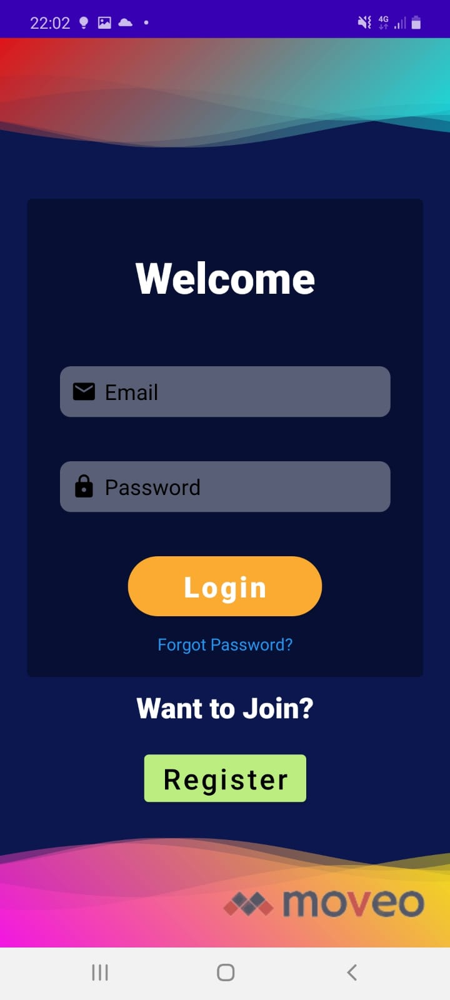
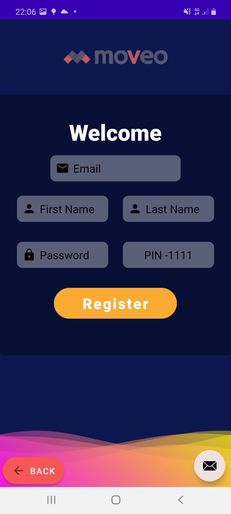
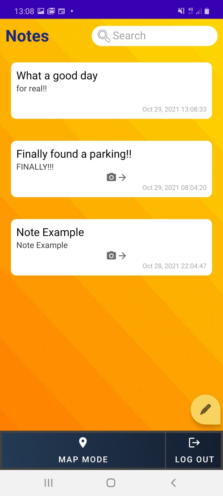
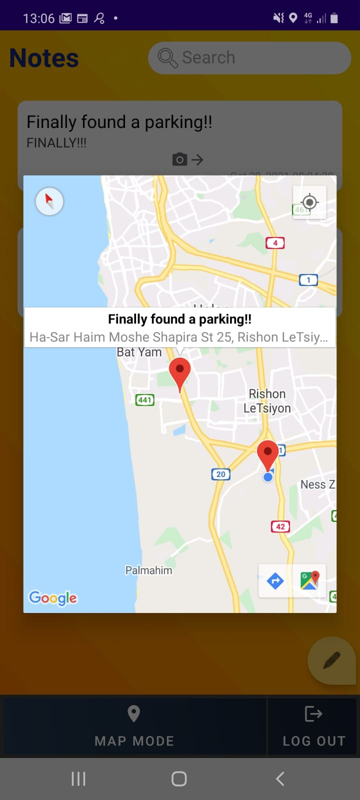
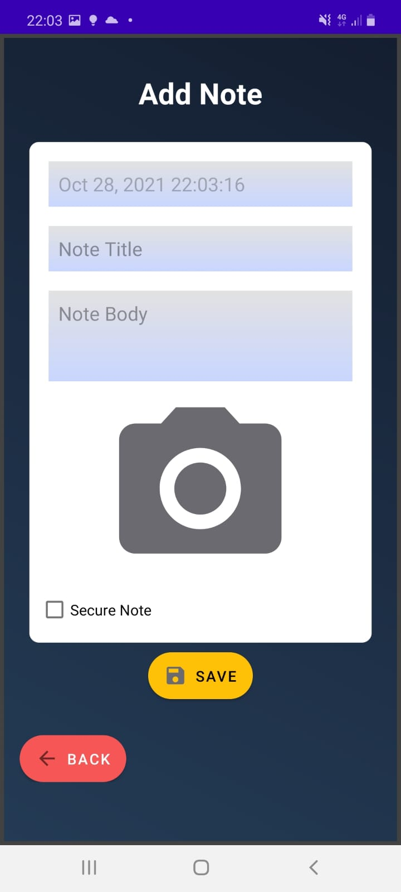

# Moveo Notes 1.0 - Android Application

<br />
<p align="center">
    <a href="https://github.com/Guy-Nudelman/Noalek-Patisserie-iOS">
      
  </a>
 </p> 
 <p align="center">
	MoveoNotes is an Android application, designed for development purposes.
It Is a location based Notes Application that allow users to save notes in more expandable way than usual.</br></br>
Feel free to contact for any future idea or feedback. </br></br>
Thanks ❤</br></br>
</p>

# The Right Way To Note


## App Functionality

1. Implementation of Users Identification and Users Registeration 
	#### Be Remembered.
	- Authentication and validation inputs of the users when entering the app.
	- Future logins to the app after registeration to the app will auto log in the user.
		</br>
2. Implementation of Firebase Database Architecture
	- Data served by the app is handled by a RepositoryDataBase that implements Firebase.
	- Local data is saved in a singleton and DB.
		</br>

3. Implementation of Notes 
	#### Now, Notes Are More Than Just A Text.
	- Each Note can have a title, body, location (Assigned by translating Latitude and Longitutde into an address using a Geocoder) and an image.
	- Notes can be marked as "important notes", so they can not be instantly deleted and must be verified with a pre-assinged PIN code.
	#### Privacy. Because The Notes Are Yours.
  	- Notes are private and uniuqe for each user, and can not be shared between users or devices.
  	#### Experience Is Key.
	- Notes can be easliy filtered by any text using a search bar.
	- Deleting a Note , or peeking it's image , can be done simply with a swipe (With in-app instructions).
	- Inturducing a "young", colorful and dynamic UI for better experience.
	</br>
4. Implamantation of GoogleMaps - allows users to track Notes by location (Assigned by translating Latitude and Longitutde into an address using a Geocoder).
	#### Remember Where You Have Been.
	- Map Mode shows current user location.
  	- For each Note, Map shows a marker at the note location , with an attached details of the relavent Note (Title and address)
	-  Clicking on a Marker will transfer the user into the Note screen , with the option to view and edit the Note.


## Getting Started...

#### Installation

 Export git repository to Android Studio.

  ```bash
https://github.com/Guy-Nudelman/MoveoNotes
```
 Build and run the application on an Android emulator.


### OR

Run apk and install application (Contact for access OR build apk through Android Studio)

  ```bash
  app-debug.apk
```

## Screenshots

Loading Page            | Login Page            |  Sign-Up Page
:-------------------------:|:-------------------------:|:-------------------------:
  |   |  

Main Feed            |  Map Mode |  New/Edit Note
:-------------------------:|:-------------------------: |:-------------------------:
  |   |  

	
## Technologies

What i've Used : 

#### SERVER SIDE

* Firsebase SDK

#### CLIENT SIDE

* Java
  * Data Structures 
  	* Hash Map
  	* Array List
  	* etc
  * Adapters
  * Collections
* MVVM
* RoomDB
* Live data
* Google services
* Glide Library

  
## Developed by:
* [**Guy Nudelman**](https://www.linkedin.com/in/guynudelman/)


## Disclamir
This is not an official Moveo Product.
